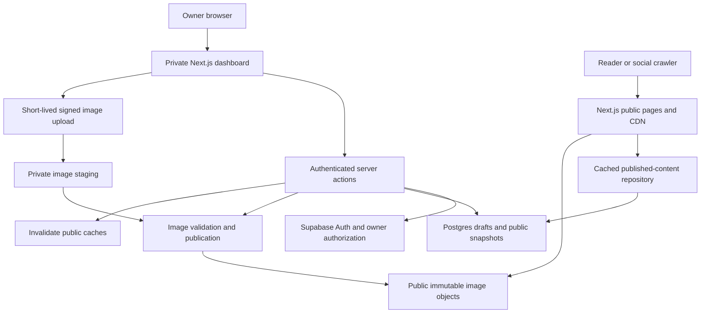

# Portfolio blog: architecture and implementation plan

Status: implemented in the repository with local checks; live Supabase provisioning and deployment require environment setup. See blog-setup.md.
Prepared: 6 October 2026.

## 1. Outcome and default decisions

Build a minimal, readable blog inside the existing portfolio. Vishal can sign in, write or import an article, upload images, preview it, publish it, and share its permanent URL without a deployment. Readers can browse posts, read comfortably on mobile or desktop, and share links with useful social previews.

Default authoring assumption: a private browser dashboard with a Markdown editor, formatting toolbar, and live preview. Include `.md` import and export. This is a deliberate first-version choice, not a full visual block editor. If a Word/Notion-style editor is required, settle that before implementation: use structured editor JSON as the canonical body and redesign import/export rather than maintaining two competing sources of truth.

| Decision | Recommendation | Reason |
| --- | --- | --- |
| Application | Existing Next.js App Router app | One deployment and familiar tooling |
| Content | Supabase Postgres | Already present; supports authoring without rebuilds |
| Authentication | Supabase Auth, one allowlisted owner | No public accounts or separate identity vendor |
| Images | Supabase Storage | Integrates with existing data and authorization |
| Body format | Markdown + GFM, no executable MDX | Portable technical writing, tables and code blocks |
| Rendering | Server Components and cached public queries | Readable HTML with small client bundles |
| Authoring UI | Custom, narrowly scoped dashboard | Reuse installed Markdown renderer and validation |
| Deployment | Existing Vercel deployment described in README | Preserve current operational model; verify actual settings |

A hosted CMS is a valid alternative if collaborative editing, a sophisticated visual editor, or scheduled publishing becomes essential. It adds another content service; it is not necessary for the requested single-author workflow. A Git-only blog is simpler but would make routine publishing depend on commits and deployments.

## 2. Repository findings that affect implementation

- `package.json`: Next.js 16.1.6, React 19.2.3, TypeScript, Tailwind v4, Supabase, Zod, `react-markdown`, `remark-gfm`, and `gray-matter` already exist.
- `src/data/blog.ts` contains three metadata-only placeholder posts. There are no article bodies. Do not invent or publish those articles as finished work.
- `src/components/sections/Blog.tsx` is a client-side card stack with `#` fallback links. It is not currently mounted in `src/app/page.tsx`.
- The Blog navigation entry is commented out. Existing navigation uses same-page fragments and must work correctly from article routes.
- `src/app/page.tsx` is a Client Component. Convert its outer composition to a Server Component and extract `ViewCounter` into a client component so latest posts can be fetched server-side. Existing animated sections can remain client components.
- The actual loaded fonts are DM Sans, Playfair Display, and JetBrains Mono. README and CLAUDE.md contain stale architecture/font descriptions; use executable code as the authority and update relevant documentation.
- `src/lib/supabase.ts` uses a secret key and imports an environment schema that requires chatbot credentials. Do not reuse this module in client code or make blog reads depend on chatbot secrets.
- Root layout mounts the custom cursor and chatbot everywhere. Scope those portfolio enhancements to the homepage; reading and editing should use normal pointer behavior and an unobstructed viewport.
- Existing SEO utilities, theme tokens, analytics, and image configuration can be extended. Sitemap currently includes only `/`.
- No test runner is currently configured. Add targeted tests for publishing and authorization rather than testing every presentational component.

## 3. Scope

### Required for launch

1. `/blog`: newest-first article list, tags, paginated browsing, empty state.
2. `/blog/[slug]`: complete article, cover/inline images, code blocks, heading links, optional table of contents, related articles, sharing.
3. Private owner sign-in and dashboard: create, edit, save, preview, import Markdown, upload images, publish/update, unpublish, archive, export.
4. Separate draft and published content: editing a live article never changes the public version until Publish updates is selected.
5. Responsive typography, light/dark mode, keyboard accessibility.
6. Per-article SEO, Open Graph image, sitemap, RSS, canonical URLs.
7. Homepage latest-posts section and working Blog navigation.
8. Database migrations, access policies, deployment instructions, backup/export instructions, meaningful tests.

### Defer

Comments, reactions, public view counters, newsletters, subscriptions, multiple authors, scheduling, full-text search, arbitrary HTML embeds, video uploads, interactive MDX, and automatic ingestion into the portfolio chatbot. None is needed for the publishing and reading loop. Add them when there is a demonstrated use case.

## 4. Reader experience and visual specification

The supplied [reference article](https://ramx.in/blog/cursor-code-indexing) provides useful structural cues: back navigation, title/deck/date, long-form sections, inline illustrations, related posts, and a return to the article list. Borrow that hierarchy rather than copying its content or assuming its exact CSS/font values. Its page content was inspected; pixel-level browser inspection was unavailable during planning.

### Layout

- Overall shell: match the portfolio's approximately 840px maximum width.
- Reading column: 680–720px maximum, approximately 65–75 characters per line; 20px mobile side padding, 32px at larger widths.
- Header: site identity, Home, Blog, theme toggle. Include a visible back-to-blog link on articles.
- Article order: title, short description, author/date/reading time, optional cover, optional contents disclosure, article, share row, up to three related posts.
- Article list: simple rows with title, description, date and reading time; optional small thumbnail. Use subtle dividers and generous spacing. Avoid the existing stacked-card interaction for browsing.
- Long articles: generate contents from H2/H3, collapse by default on small screens. Do not squeeze a permanent sidebar into the existing narrow shell.
- No article reveal animations that delay content or hide it when JavaScript fails.

### Typography

| Element | Font and target treatment |
| --- | --- |
| Article title | Playfair Display 700; 34–48px responsive; line-height 1.15 |
| Body | DM Sans 400; 17px mobile, 18px desktop; line-height 1.75–1.8 |
| H2 / H3 | DM Sans 600/700; around 28px / 22px desktop; generous space above |
| Metadata/captions | DM Sans, 13–14px; readable muted color |
| Code | JetBrains Mono, 13–14px; horizontal scrolling inside blocks |

Use existing `next/font` variables. Scope article styles in a CSS module or `.blog-prose` container. Preserve homepage styling. Links stay visibly distinguishable without hover. Images retain natural proportions; diagrams must not be cropped. Tables scroll within their container, never widen the whole page. Heading anchors account for the sticky header. Verify dark/light contrast, 200% zoom, reduced motion, and visible focus rings.

## 5. System architecture



Keep the implementation a modular monolith. There is no need for a separate API service, queue, Redis cache, search cluster, or custom CDN in version one. Use the database for content and ownership; Next.js handles rendering/cache; storage serves image bytes.

Public query code and admin mutation code must be separate modules. Public queries use a publishable-key client with no session and database policies that allow only public snapshots. Admin operations verify the user on the server. Privileged media operations use a server-only secret-key client after owner authorization.

## 6. Content model

Use migrations under `supabase/migrations/`, generated database TypeScript types, UTC timestamps, database constraints, and Zod request validation. Names below are contracts; implementation may refine SQL without changing behavior.

### `blog_admins`

- `user_id uuid primary key references auth.users`.
- Provision one owner manually through a controlled migration/setup step after creating the account.
- Users cannot add themselves or mutate this table. Use a constrained database helper for membership checks without recursive RLS policies.

### `blog_posts` — private working copy

- `id uuid`, `author_id uuid`, `slug text unique`, `title text`, `excerpt text`.
- `body_markdown text`, `cover_media_id uuid nullable`, `tags text[]`.
- `seo_title text nullable`, `seo_description text nullable`.
- `version integer`, `created_at`, `updated_at`, `archived_at nullable`.
- `first_published_at nullable`: persists through unpublishing and determines whether the slug is locked.
- Drafts may be incomplete; publication has stricter validation.

### `blog_publications` — public snapshot

- `post_id uuid primary key references blog_posts`, unique `slug`.
- Copy all public content fields from the working copy at publication time, including resolved public media references.
- `author_name`, `published_at`, `modified_at`, `reading_minutes`.
- `source_version integer`: the draft version used to create this snapshot.
- No private editor state, upload credentials, or draft-only fields.
- A publication row means the article is public. Removing it unpublishes the article while retaining the working copy.

### `blog_media`

- `id uuid`, `owner_id uuid`, `post_id uuid` (one owning post in v1).
- `private_object_path`, `public_object_path nullable`, `mime_type`, `bytes`, `width`, `height`, `checksum`.
- `alt_text`, `caption nullable`, `created_at`, `validated_at nullable`.
- State: `pending`, `ready`, `published`, `failed`.
- Store object paths and media IDs; never persist expiring signed preview URLs as article content.

### `blog_publication_media`

- `(post_id, media_id)` composite primary key linking the public snapshot to its cover and inline assets.
- Used for public metadata access policies, usage checks, and cleanup protection.

### Constraints and indexes

- Slugs: lowercase kebab-case, 3–120 characters, database uniqueness. Lock after first publication; slug changes and redirect management are deferred.
- Title: required at publish, maximum 160 characters. Excerpt: required at publish, maximum 300. Markdown: maximum 500KB UTF-8. Tags: at most five, normalized, each at most 30 characters.
- Draft autosaves use `version` compare-and-swap. A stale save returns a conflict; never silently overwrites another tab.
- Publish checks the expected version in the same transaction that writes the public snapshot.
- Index publication ordering on `(published_at desc, post_id desc)`; draft listing on `(author_id, updated_at desc)`; add GIN on publication tags if tag filtering needs it.
- Public list queries select summaries, not article bodies. Page size: 12, with deterministic ordering. Start with bounded page-number pagination; move to cursor pagination if measured deep-page costs justify it.

## 7. Authoring and publication workflows

### Write/import

1. Owner signs in at `/admin/login` through Supabase magic link. Disable self-service signup; provision the owner. Configure production callback URLs and email delivery.
2. Create a draft with a stable UUID before accepting image uploads.
3. Edit title, excerpt, proposed slug, tags, cover, and Markdown. Toolbar supports headings, bold, italic, links, lists, code, quotes, tables, and image insertion.
4. Autosave after approximately 1.5 seconds of inactivity; serialize/coalesce saves. Show Saving, Saved, Failed, and Conflict states. Keep explicit Save and warn before leaving with unsaved changes.
5. `.md` upload imports UTF-8 Markdown and supported YAML frontmatter through a strict schema. Reject executable `.mdx`, custom frontmatter engines, oversize files, and unsupported values; show field-level errors. Import creates a draft and never publishes automatically.
6. Imported relative image paths show as unresolved. Provide an image upload/mapping step; do not fetch arbitrary URLs or pretend local files were uploaded. External image links must be replaced with uploaded media before publishing in v1. External hyperlinks remain supported.
7. Preview the saved draft using the same renderer as public articles. Preview remains owner-authenticated, uncached, and `noindex`; no shareable draft tokens in v1.

### Publish/update

1. Flush pending saves and freeze the expected draft version for the operation.
2. Validate title, excerpt, slug, body, metadata, media ownership/readiness, and all media references. Reject unresolved image references and unsafe URL protocols.
3. Copy validated referenced images to immutable public paths; deterministic checksum/version paths make retries safe. This prepares only assets explicitly selected for publication. Storage and Postgres are not one atomic transaction: failed attempts may leave unreferenced public copies, which cleanup can reclaim later.
4. In one authorized database transaction, lock/check the draft version, replace the publication snapshot and its media links, and preserve the original publication date. Update the modification date only for a publication change. Use a restricted RPC where needed; explicitly constrain grants and `search_path` for any security-definer function.
5. Make retries idempotent using `(post_id, source_version)`: publishing an already-published version succeeds without changing timestamps or duplicating assets.
6. Expire public caches only after the database commit. Return the canonical article URL and offer View article / Copy link.
7. If cache invalidation fails after commit, report Published; refresh pending, log the failure, and offer an owner-only retry. Do not report a database rollback when publication already succeeded.

Saving later edits only modifies `blog_posts`. Dashboard status is derived from publication presence, `archived_at`, and whether the working version differs from `source_version`: Draft, Published, Published with unpublished changes, Archived.

### Unpublish/archive/export

- Unpublish removes the snapshot/media links transactionally, keeps the draft, and expires article, listing, metadata, and feed caches. Subsequent fresh requests return 404. Already downloaded pages and third-party social caches cannot be recalled.
- Published images are public assets and may remain accessible by their old URLs/CDN caches after unpublishing. Clearly state this in the dashboard. Private draft uploads remain private until selected for publication.
- Archive is a recoverable state; archiving a published post must explicitly perform the unpublish flow. Exclude archived posts from the default admin list and support Restore.
- Export Markdown plus metadata and an asset manifest. Document a separate storage download/backup procedure so content is recoverable without this application.
- Do not add permanent deletion in the initial dashboard.

## 8. Image pipeline

Use two buckets: private staging and public published assets. Public storage bypasses download access controls, so never put unpublished uploads into the public bucket. Supabase documents bucket access behavior in its [bucket fundamentals](https://supabase.com/docs/guides/storage/buckets/fundamentals).

1. `POST /api/admin/blog/media/upload-url`: verify owner, post ownership, content type, and quota; reserve a media ID and issue a short-lived upload authorization for one generated object path.
2. Browser uploads directly to private storage. Avoid sending binary uploads through Server Actions.
3. `POST /api/admin/blog/media/complete`: verify the actual uploaded bytes, not just the browser's extension or MIME header. Decode and validate dimensions with a server-side image library such as `sharp` before marking ready.
4. Initial accepted formats: JPEG, PNG, WebP. Maximum 5MB per original, 20 megapixels, 50 referenced images per article, 100MB per draft; bound concurrent validations. Reject SVG, HTML, GIF, and unsupported formats with clear messages.
5. Strip metadata by re-encoding; retain adequate resolution for readable diagrams, cap longest edge at 2400px. Preserve an original in private storage if needed for future regeneration. Use real decoded dimensions for layout.
6. Editor inserts a stable internal reference such as ``. Parse this as a controlled Markdown image node and resolve it through the media manifest. Do not enable arbitrary custom URL schemes globally in the renderer.
7. Draft previews receive short-lived private image URLs only after authorization; the private preview must not go through a publicly cacheable image optimizer. Published rendering uses `next/image` with public paths, width/height, and responsive `sizes`.
8. Require nonempty alt text for article images at publish; support optional captions through media metadata. Do not overwrite published image paths; replacement creates a new asset.
9. Restrict `next.config.ts` remote patterns to the actual Supabase host and public blog bucket path. Keep existing portfolio hosts where still needed.
10. A documented cleanup command can remove failed/pending uploads older than seven days after checking references. Never delete referenced media. An automatic scheduler is unnecessary initially.

Storage writes are restricted to the owner/server, with policies matching generated paths. Supabase Storage supports policy-based access control; secret keys bypass those policies and must remain server-only. [Storage access control](https://supabase.com/docs/guides/storage/security/access-control)

## 9. Rendering, caching, and routes

### Public routes

| Route | Responsibility |
| --- | --- |
| `/blog` | Published summaries, `?page=`, optional `?tag=` |
| `/blog/[slug]` | Article HTML and article-specific metadata |
| `/blog/[slug]/opengraph-image` | 1200×630 title/author card, optional cover |
| `/feed.xml` | RSS with published title, excerpt, canonical link, timestamps |
| `/sitemap.xml` | Homepage, blog index, published article URLs |

### Private routes

| Route | Responsibility |
| --- | --- |
| `/admin/login` | Owner sign-in |
| `/auth/callback` | Complete auth with validated local redirect |
| `/admin/blog` | Draft/published/archived list |
| `/admin/blog/new` | Create a draft |
| `/admin/blog/[id]/edit` | Editor and publishing controls |
| `/admin/blog/[id]/preview` | Private, uncached preview |
| `/api/admin/blog/media/*` | Upload reservation and completion |

### Repository boundaries

Public methods: `listPublishedPosts`, `getPublishedPostBySlug`, `getRelatedPosts`, `listSitemapEntries`. Admin methods: `createDraft`, `saveDraft`, `getDraft`, `publishPost`, `unpublishPost`, `archivePost`, `restorePost`, `exportPost`. Implement these directly in server modules; do not make Server Components fetch the app's own API.

Use `react-markdown` + `remark-gfm` and controlled node components for headings, links, images, tables, and code. Disable raw HTML; never compile uploaded MDX/JavaScript. Render syntax highlighting on the server with a small supported language set and a plain-text fallback. Generate unique stable heading IDs, including repeated headings. Derive reading time from article text at publication. Code copy, share controls, and contents disclosure are small client components.

### Cache contract

- Preserve the current Next.js configuration; do not enable Cache Components globally as an incidental change. Wrap public Supabase reads in `unstable_cache`, with explicit keys, tags, query parameters, and a 300-second revalidation setting. The API is documented but is a future migration candidate; see [Next.js unstable_cache](https://nextjs.org/docs/app/api-reference/functions/unstable_cache).
- Tags: `blog:posts` for lists/feeds; `blog:post:<id>` and `blog:slug:<slug>` for details. Use the same repository in article and metadata generation so versions match.
- Do not cache sessions, cookies, admin data, signed preview URLs, or errors as successful empty results. Keep public clients/session-free reads independent of auth cookie refresh.
- Pages can use ISR/on-demand generation; allow newly published slugs without rebuilding. Do not rely solely on a build-time `generateStaticParams` list. Ensure cached 404s are invalidated on first publication.
- After a mutation, immediately expire affected tags and paths: article, OG route, `/blog`, `/`, `/feed.xml`, `/sitemap.xml`. Use `updateTag` in Server Actions when appropriate, or `revalidateTag(tag, { expire: 0 })` in Route Handlers. Do not use stale-while-revalidate `max` semantics for unpublishing. Verify exact API behavior against installed Next.js 16.1.6. [Next.js revalidation semantics](https://nextjs.org/docs/app/api-reference/functions/revalidateTag)
- A time-based revalidation period is a recovery aid, not a guaranteed deadline for removing stale content. Explicit expiration, error handling, and production-mode tests are required. Cache failure after unpublish must be visibly reported to the owner and retried.
- The article must be readable with JavaScript disabled. Cache public HTML where the route permits; list search parameters may affect route rendering mode while the underlying public queries remain cached.

## 10. Authentication and data access

- Add `@supabase/ssr` and separate browser, session-server, public-read, and privileged-server clients. Use server-only imports for privileged modules and domain-scoped environment validation.
- Follow cookie-based SSR auth and verified identity checks from [Supabase's server client guidance](https://supabase.com/docs/guides/auth/server-side/creating-a-client?queryGroups=framework&framework=nextjs). Never trust a browser-supplied user ID or an unverified session object as authorization.
- Check `blog_admins` membership on every mutation/upload/preview request, not merely in the admin layout. Use `getUser()` for sensitive server mutations to verify against Auth, then database membership.
- Enable RLS on every blog table. Anonymous access: select only publication rows and media metadata referenced by them. Authenticated non-owners: no additional access. Owner: private draft/media access. Published-snapshot mutations flow through the constrained publishing function, not arbitrary client writes.
- If using Next.js `proxy.ts` for cookie refresh, restrict its matcher to auth/admin routes so public articles remain independent of sessions.
- Admin and preview responses: private/no-store and noindex. Robots exclusions complement authentication; they do not replace it.
- Server Actions and upload endpoints validate inputs and authorization. Cookie-authenticated custom mutation routes validate origin/CSRF protections. Auth redirects accept only permitted local destinations.
- Add bounded upload/login throttling; use provider auth protections and persisted upload reservations for quota enforcement rather than trusting process-local counters in serverless instances.
- Escape JSON-LD safely, allow only expected link protocols, and do not introduce arbitrary remote-image downloading.

Environment additions: `NEXT_PUBLIC_SUPABASE_URL`, `NEXT_PUBLIC_SUPABASE_PUBLISHABLE_KEY`; a server-only Supabase secret for privileged operations; a canonical production site URL. Reconcile existing variable names explicitly rather than silently creating conflicting clients. Keep preview deployments from using production write credentials by default. Never expose secrets through `NEXT_PUBLIC_*`.

## 11. SEO and sharing

- A canonical permanent URL per article: `https://www.vishaljadeja.xyz/blog/<slug>` using centralized site configuration.
- Override inherited homepage canonical, description, Open Graph type/title/URL/image, and Twitter card for each article. Set article publication/modification timestamps and author.
- Add `BlogPosting` and breadcrumb JSON-LD. Keep existing Person/site structured data without duplicating incompatible article metadata.
- Generate a predictable social image from published fields. Use a text-first fallback if a cover cannot load. Public OG endpoints must not depend on an admin cookie.
- Include only published articles in sitemap/RSS and use actual publication modification times. Escape XML correctly. Feed uses excerpts initially.
- Share UI: Copy link with success/error feedback, native share when supported, LinkedIn and X links. Open share URLs only after a user action. No social SDK or automatic posting.
- Filtered listings should be noindex/follow initially to limit duplicate index pages; unfiltered paginated pages have self-canonical URLs. Unknown article slugs return real 404s.
- Preview deployments and admin pages remain noindex. Keep production canonicals intentional; do not accidentally use a preview hostname for copied production links.
- Social platforms cache cards independently. Updating the site does not guarantee immediate refresh of an already-shared card.

## 12. Suggested file map

```text
docs/blog-architecture-plan.md
supabase/migrations/*_blog_schema.sql
supabase/migrations/*_blog_policies.sql
src/app/blog/layout.tsx
src/app/blog/page.tsx
src/app/blog/[slug]/page.tsx
src/app/blog/[slug]/opengraph-image.tsx
src/app/blog/loading.tsx
src/app/blog/error.tsx
src/app/blog/not-found.tsx
src/app/feed.xml/route.ts
src/app/admin/login/page.tsx
src/app/auth/callback/route.ts
src/app/admin/blog/page.tsx
src/app/admin/blog/new/page.tsx
src/app/admin/blog/[id]/edit/page.tsx
src/app/admin/blog/[id]/preview/page.tsx
src/app/api/admin/blog/media/upload-url/route.ts
src/app/api/admin/blog/media/complete/route.ts
src/components/blog/{BlogHeader,PostList,ArticleBody,ArticleImage,ShareBar,TableOfContents,RelatedPosts}.tsx
src/components/blog/blog-prose.module.css
src/components/admin/blog/{PostEditor,MediaUploader,PublishControls}.tsx
src/components/ViewCounter.tsx
src/components/PortfolioEnhancements.tsx
src/lib/blog/{types,schemas,queries,admin,actions,markdown,media,cache,metadata}.ts
src/lib/supabase/{browser,server,public,admin}.ts
src/lib/config/blog-env.ts
src/lib/database.types.ts
src/proxy.ts
tests/blog/*
```

Also update `src/app/page.tsx`, `layout.tsx`, `sitemap.ts`, `robots.ts`, `Navbar.tsx`, the existing Blog section, `next.config.ts`, README, environment examples, and package scripts. Move or deprecate `src/lib/supabase.ts` carefully: preserve current API imports or migrate them deliberately, avoiding an ambiguous file/directory import. Retire placeholder blog data from public rendering; keep demo fixtures in tests only.

New dependencies should be limited to SSR auth, server image validation, server syntax highlighting, and test tooling. Reuse existing Markdown/GFM/frontmatter/Zod packages. Validate Node/runtime requirements for pinned dependencies; the README's Node 18 claim must not be assumed correct for this Next.js installation.

## 13. Implementation phases and acceptance gates

### Phase 1 — data and ownership

Create schema, indexes, publication transaction/RPC, RLS, isolated clients/env, owner auth, and test fixtures. Add an authenticated dashboard shell. Document owner provisioning, callback URLs, and storage configuration.

Gate: owner can save a private draft; anonymous and non-owner clients cannot read or mutate it through either application endpoints or direct Supabase requests. Blog modules do not require chatbot credentials.

### Phase 2 — public reading experience

Implement published queries, blog list/article routes, prose renderer, typography, code/tables, theme behavior, contents, and responsive states. Use seeded development publications only.

Gate: complete article renders in initial HTML, works without client JavaScript, and is readable at 360px, 768px, and 1440px in both themes. No unintended horizontal page scrolling.

### Phase 3 — authoring, media, publishing

Build editor/preview, Markdown import/export, autosave/conflict handling, media validation, snapshot publish/update, unpublish/archive/restore, and cache invalidation.

Gate: create/import → image upload → preview → publish → edit draft → publish update → unpublish works end-to-end. Draft edits and uploads remain private. Publishing a new slug needs no deployment. Failure/retry does not duplicate publication or silently lose edits.

### Phase 4 — integration, discovery, sharing

Connect navigation and homepage latest posts, extract client-only home behavior, scope global enhancements, add metadata/OG/RSS/sitemap, share controls, and related posts (shared tags, then recency, excluding current post).

Gate: every visible post link resolves; homepage/list/article/feed agree on publication status; copied links are canonical; OG metadata is server-rendered and image endpoints return usable images.

### Phase 5 — verification and release

Run lint, typecheck, production build, targeted database/integration tests, browser workflow tests, and visual checks. Deploy to a preview environment with separate test data and verify production-mode caching. Document backup/export, rollback, owner setup, and recovery from publication/cache failures.

Gate: all acceptance tests below pass or unresolved environment limitations are explicitly reported. Publish the first real article only from author-provided content. Remove development seeds from production.

## 14. Required verification

| Area | Scenarios |
| --- | --- |
| Authorization | Anonymous/non-owner draft access denied; direct DB/API writes denied; forged IDs rejected; private storage unreadable anonymously |
| Draft consistency | Two-tab version conflict; save retry; expired session; leave with unsaved text; edit published article without leaking changes |
| Publication | Initial publish; duplicate slug; duplicate publish request; concurrent stale publish; missing media; failed asset promotion; DB commit failure; invalidation failure |
| Unpublication | Cached article, metadata, homepage, listing, sitemap, and RSS invalidated; fresh article requests return 404 |
| Images | Invalid MIME/bytes, oversize and huge-dimension files, unauthorized media ID, broken upload, alt validation, URL expiry, image replacement |
| Markdown | Raw HTML/script attempt, unsafe link scheme, repeated headings, long code, unknown language, wide table, external/local unresolved image |
| Sharing/SEO | Correct canonical and escaped JSON-LD/XML, OG image, noindex draft/admin, clipboard failure, native-share cancellation |
| Accessibility | Keyboard-only reading/editing, labeled controls, visible focus, screen-reader save/share status, 200% zoom, light/dark contrast |
| Integration | Portfolio nav/theme/chat still work on home; blog has working Home links; zero/one/two/many posts; no modulo-zero card behavior |
| Operations | Database outage produces an error rather than fake empty content; export plus media backup recovery documented and sampled |

Use Vitest for validation/Markdown/SEO helpers and SQL integration checks for RLS and transaction rules. Verify the publishing flow and cache behavior manually against `next build && next start`, not only development mode.

Performance targets for representative production-like pages: LCP ≤2.5s, CLS ≤0.1, INP ≤200ms where field measurement is available. These are targets, not capacity claims. Keep the editor and syntax-highlighting engine out of reader client bundles; load images responsively and reserve layout space. Existing Vercel monitoring can establish actual results after launch.

## 15. Scale and operations

- Most traffic should read cached article data/HTML and immutable image assets. Publishing is relatively rare and can remain synchronous within a bounded request.
- Limit article payload and image counts so image promotion cannot become an unbounded serverless job. Reuse already-promoted assets. If measured publication times approach deployment limits, move media preparation to a durable job and show a Publishing state; never expose a partial article.
- At larger content volume, measure query plans and deep-page latency before replacing offset pagination or adding Postgres full-text search. Avoid downloading every article to filter in the browser.
- Monitor publication failures, media validation failures, 5xx responses, database latency, storage size/egress, and image optimization usage. Log request/post IDs and stages, not draft bodies or credentials.
- Costs come from existing hosting, Supabase database/auth/storage, email delivery, image transformation and egress. Verify account-specific quotas during deployment; this plan does not assume unlimited free service or quote unverified prices.
- Maintain versioned migrations, periodic content exports, database backups appropriate to the account, and separate storage backups. Database backups alone do not recover image bytes.
- Release schema changes additively. Application rollback should not require dropping content tables. Keep public output available during editor changes where possible.

## 16. Sol handoff

Suggested implementation instruction:

> Implement `docs/blog-architecture-plan.md` in the existing portfolio repository, working through its five phases. Use the current executable code over stale README descriptions. Preserve homepage behavior and reuse the existing fonts/theme. Build the owner dashboard with a Markdown toolbar/live preview and `.md` import/export, separate private drafts from public snapshots, validate uploaded images, and keep auth/secrets out of public code. Implement public reading, sharing, metadata, feed, and cache invalidation end-to-end. Run the listed checks, report any provisioning blockers precisely, and do not fabricate production articles or claim deployment without verifying it.

External setup needed during implementation: Supabase project access/migrations, a provisioned owner, auth callback/email configuration, private/public buckets, and deployment environment variables. These are setup requirements, not work completed by this plan.
